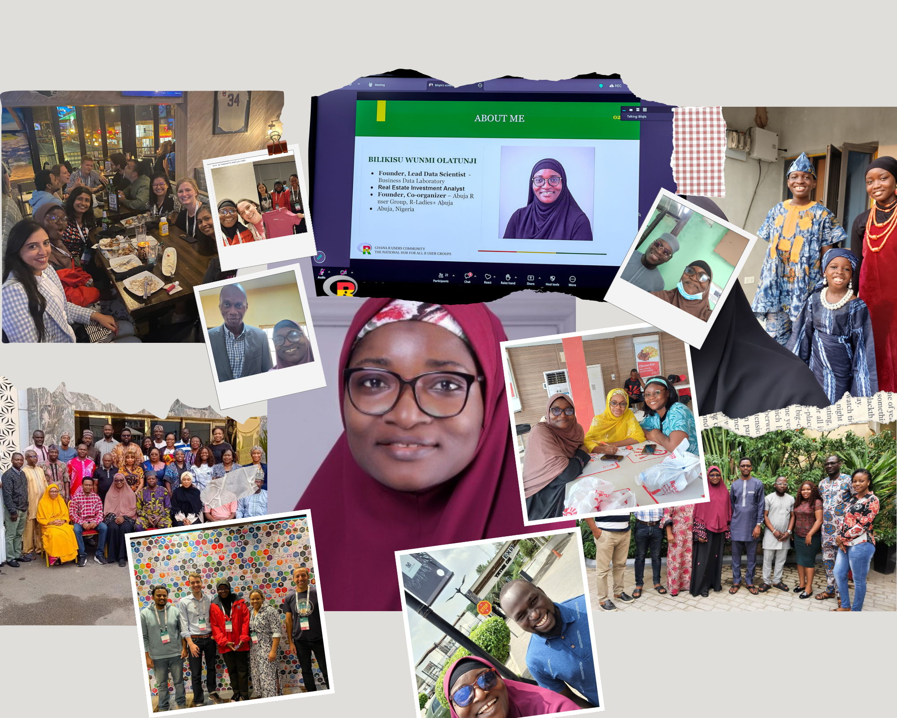
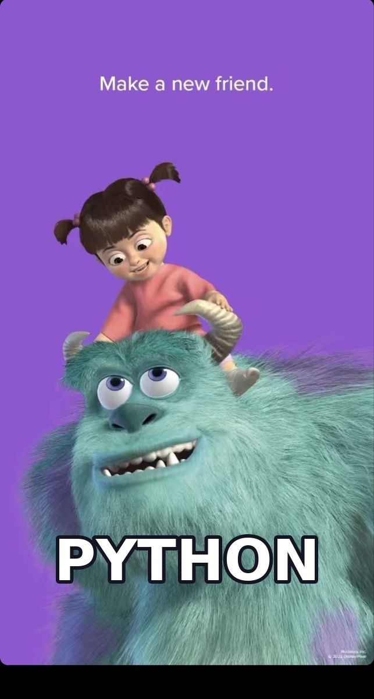

##  {.center .dark-slide data-background-color="#001f3f"}

::: r-fit-text
My story today ....
:::

. . .

::: {.r-fit-text style="color: #ffcc00; margin-top: 30px;" data-id="goal-1"}
I didn't abandon R. I added Python.
:::

::: notes
Hook: Start strong and provocative. The contrast between building and throwing away should grab attention.
:::

# Who am I? {.center .dark-slide data-background-color="#001f3f"}

# I'm Bilikisu Olatunji {.center .dark-slide data-background-color="#001f3f"}

::: {style="font-size: 1.5em; margin-bottom: 0;"}
:::

::: {.r-fit-text style="color: #ff3b30; margin-top: -50px;" data-id="goal-2"}
{width="100%" style="border-radius: 10px; box-shadow: 0 4px 6px rgba(0, 0, 0, 0.1); max-height: 700px; object-fit: cover;"}
:::

#  {.center .dark-slide data-background-color="#001f3f"}

. . .

::: {.r-fit-text style="color: #ff3b30; margin-top: 30px;" data-id="goal-1"}
Something started shifting!
:::

::: {.r-fit-text style="color: #ff3b30; margin-top: -500px;" data-id="goal-2"}
{width="80%" style="border-radius: 10px; box-shadow: 0 4px 6px rgba(0, 0, 0, 0.1); max-height: 700px; object-fit: cover;"}
:::

##  {.center .dark-slide data-background-color="#001f3f"}

::: {.r-fit-text .center style="color: #3b8132; margin-top: 30px;" data-id="opt-1"}
Opportunities Knocked
:::

::::::::: columns
:::: {.column width="50%"}
::: {.frag-box .frag-1 .fragment data-fragment-index="1"}
### Senior Data Scientist 🚫

"🐍 Python, MLflow, DVC,..."
:::
::::

:::: {.column width="50%"}
::: {.frag-box .frag-2 .fragment data-fragment-index="2"}
### Data Analyst - 6 months 🚫

"Python 🐍 Required"
:::
::::

:::: {.column width="100%"}
::: {.frag-box .frag-3 .fragment data-fragment-index="3"}
### Contract Jobs 🚫

"Data Analyst - Python 🐍, SQL,..."
:::
::::
:::::::::

# The Realization {.center .dark-slide data-background-color="#001f3f"}

. . .

::: {.incremental style="font-size: 2.5em; margin-top: 50px;"}
[**Waiting until I felt ready was costing me opportunities.**]{.hl-red}
:::

# I STARTED SMALL {.center .dark-slide data-background-color="#001f3f"}

. . .

::: {.incremental style="font-size: 1.5em; margin-top: 50px;"}
I didn't decide to [become a Python expert]{.hl-green}. I decided to take one project.
:::

# Getting My Hands Dirty {.center .dark-slide data-background-color="#001f3f"}

. . .

::: {style="font-size: 1.5em; line-height: 2; margin-top: 40px;"}
- I didn’t [**know everything**]{.hl-red}. [I learn through doing]{.hl-green}.
- I made [**mistakes**.]{.hl-red} [I got support from colleagues]{.hl-green}
- I got [scared]{.hl-red}. [**But I kept going**, one step at a time]{.hl-green}.
:::

. . .

::: {.incremental .center style="color: #3b8132;font-size: 2.5em; margin-top: -30px;"}
I COMPLETED MY FIRST PROJECT!  🥳🎉🎊🤸🥂🍾･
:::

#  {.center .dark-slide data-background-color="#001f3f"}

::: {.r-fit-text style="color: #ff3b30;" data-id="ready-1"}
{width="100%" style="border-radius: 10px; box-shadow: 0 4px 6px rgba(0, 0, 0, 0.1); max-height: 1000px; max-width:1092px object-fit: cover;"}
:::

# My Playbook {.center .dark-slide data-background-color="#001f3f"}

. . .

::: {.incremental .hl-green style="font-size: 3.0em; margin-top: 50px;"}
**WRAP ➜ VALIDATE ➜ SWAP**
:::

# MY EXPERIENCE - THREE REAL STORIES {.center .dark-slide data-background-color="#001f3f"}

# Three Scenarios {.center .dark-slide data-background-color="#001f3f"}



# WHAT I LEARNED {.center .dark-slide data-background-color="#001f3f"}

. . .

::: {.incremental style="font-size: 1.6em; line-height: 2; margin-top: 40px;"}
1.  Your [first language]{.hl-green} isn't [your last]{.hl-yellow}.
2.  [Confidence]{.hl-green} comes after [action]{.hl-yellow}.
3.  Protect [your principles]{.hl-green}, not [your tools]{.hl-yellow}.
4.  [Focus]{.hl-yellow} on [the problem and the value]{.hl-green}.
5.  [You don't need to be ready]{.hl-yellow} to [begin]{.hl-green}.
:::

# I DIDN'T ABANDON R - I ADDED PYTHON {.center .dark-slide data-background-color="#001f3f"}

::: notes
And maybe that's the real lesson. Growth doesn't always require abandoning what made you strong. Sometimes, it simply requires being brave enough to build on it.
:::

# THANK YOU {.center .dark-slide data-background-color="#001f3f"}

# QUESTIONS/ANSWERS {.center .dark-slide data-background-color="#001f3f"}
